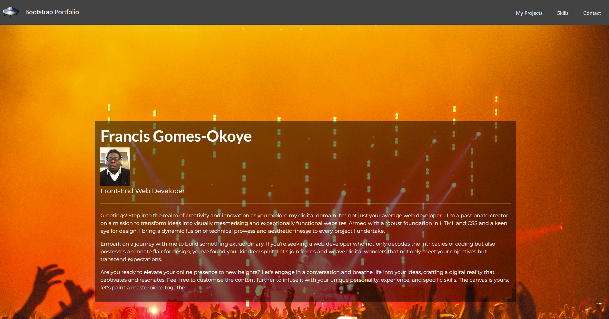
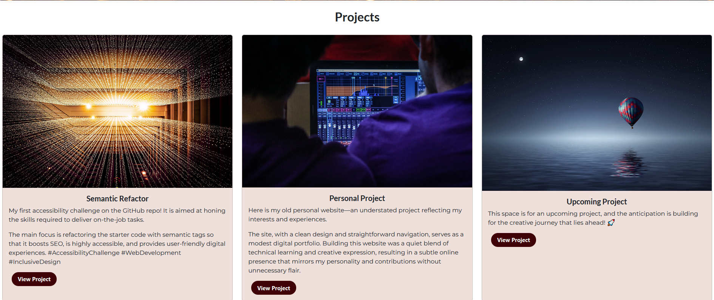
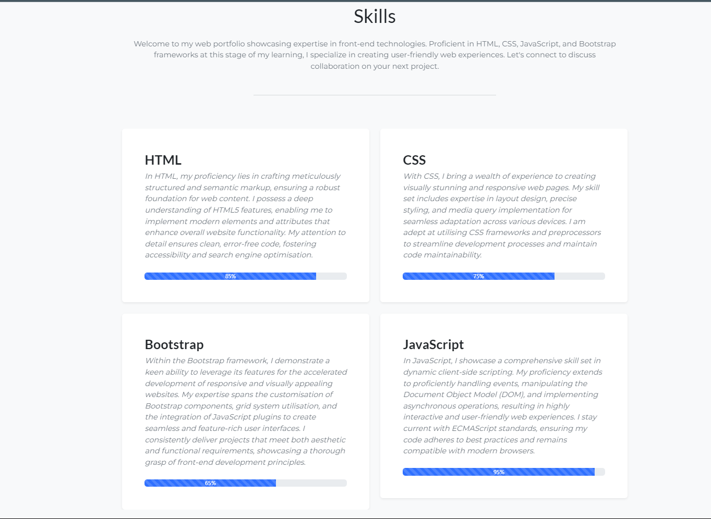

# Unit 3 Challenge: Code Bootstrap Portfolio

## Description

I created this bootstrap porfolio to showcase my learning thus far and to recreate the porfolio created earlier using Flex and/or CSS grid. As I mentioned in the reading of that task, it did not go according to plan due to some technical and health difficulties. However, I have tackled this task, "Bootstrap Portfolio," as best as possible. Both portfolios are works in progress, and I will revisit them to apply the levels of refinement they deserve as I learn more dos and don'ts.

## Table of Contents (Optional)

If your README is long, add a table of contents to make it easy for users to find what they need.

-   [Installation](#installation)
-   [Usage](#usage)
-   [Credits](#credits)
-   [License](#license)

## Installation

N/A

## Usage

You can view the website via this link: https://francis-gomes-esq.github.io/bootstrap-portfolio/

   

## Credits

-   Tutoring session
-   Discussion with a TA during office hours
-   Collaborated with Jermaine

### List of third-party assets.

-   Jumbotron: 02-Stu-Custom-Webpage/starter/index.html
-   Bootstrap Skills: https://htmlcssfreebies.com/demo/?id=878
-   Bootstrap List group: https://getbootstrap.com/docs/5.3/components/list-group/

If you followed tutorials, include links to those here as well.

## License

-   Please refer to the README.md
