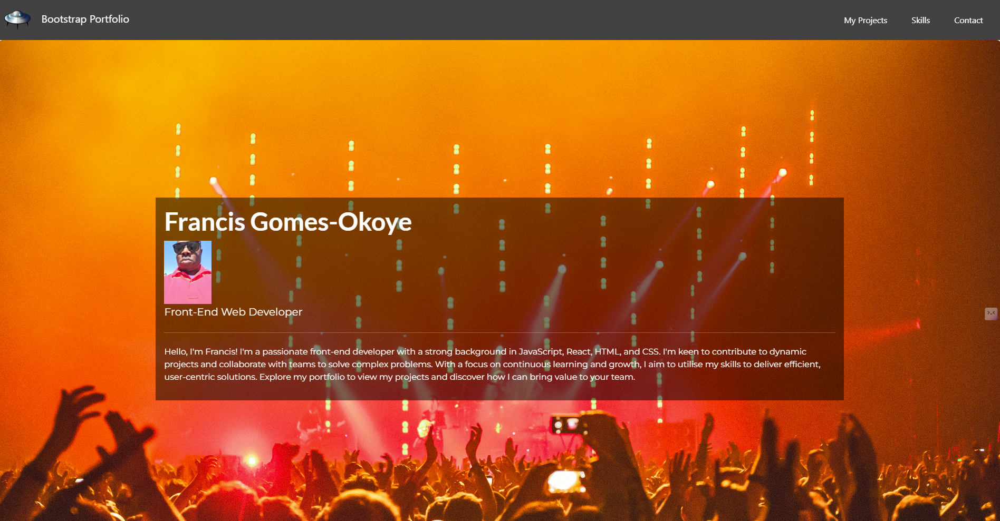
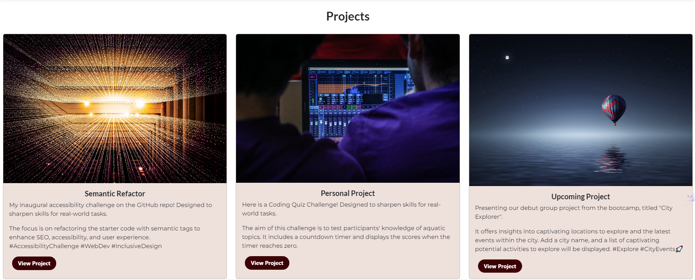

# Unit 3 Challenge: Code Bootstrap Portfolio

## Description

I used Bootstrap to simplify responsive web design, aiming to enhance user experiences. The project addressed the challenge of consistency across devices, utilising Bootstrap's pre-built components and responsive grid system for efficiency. Through this, I learned to leverage Bootstrap effectively, gaining insights into mobile-first design principles. The experience highlighted the framework's practical application in modern web development, streamlining the design process.

## Table of Contents

-   [Installation](#installation)
-   [Usage](#usage)
-   [Credits](#credits)
-   [License](#license)

## Installation

N/A

## Usage

You can view the website via this link: https://francis-gomes-esq.github.io/bootstrap-portfolio/

   

## Credits

-   Tutoring session
-   Discussion with a TA during office hours
-   Collaborated with Jermaine

### List of third-party assets.

-   Jumbotron: 02-Stu-Custom-Webpage/starter/index.html
-   Bootstrap Skills: https://htmlcssfreebies.com/demo/?id=878
-   Bootstrap List group: https://getbootstrap.com/docs/5.3/components/list-group/

## License

-   Please refer to the repo
